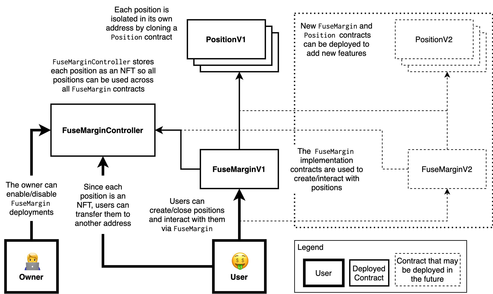

# Fuse Margin Trading



The Fuse margin trading contracts allow you to open and close leveraged longs/shorts on any asset in 1 click.

## Compile

First fill out the environment variables in `.env` following the `.env.sample` template. Then run:

```
yarn compile
```

## Test

```
yarn test
```

## Deploy

```
yarn evm
yarn deploy
```
